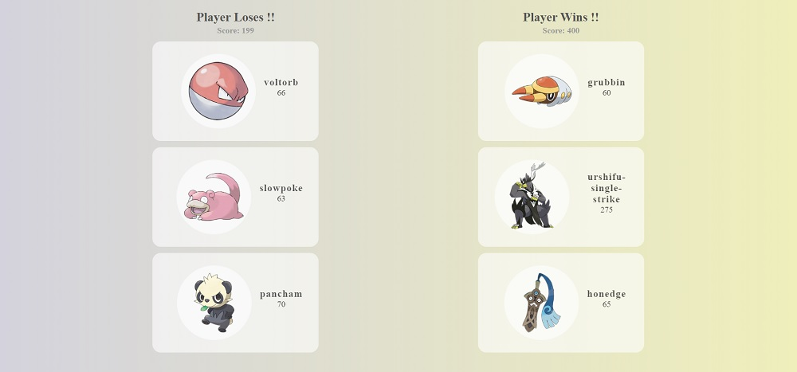
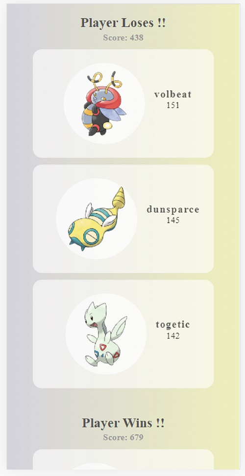
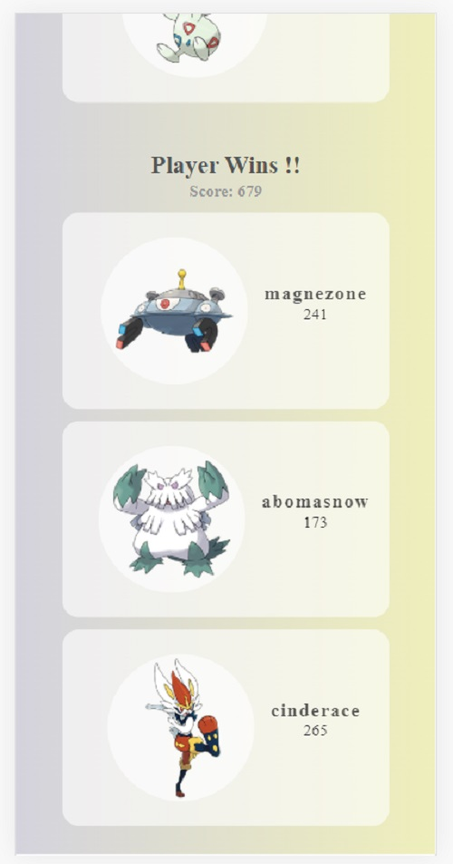

# Pokemon Game in ReactJS

link to the app : https://pokedex-project-1107-itssamyak.vercel.app/

This project was bootstrapped with [Create React App](https://github.com/facebook/create-react-app).

This app gets Data from the API and which provides the data for displaying in the application.

The Game is played between 2 people who just draws random cards out of PokeDek. The cards drawn with maximum Base experience wins the game !!.

